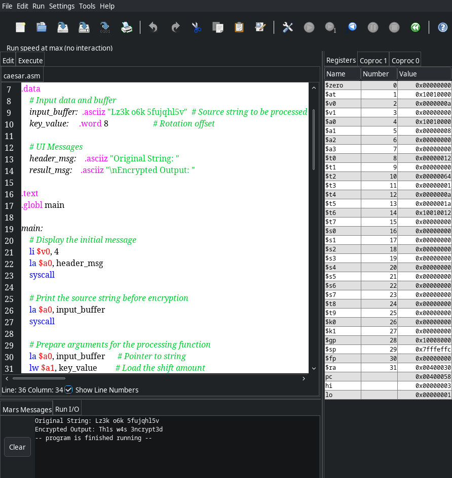
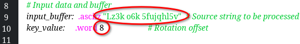
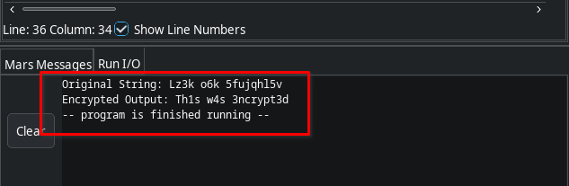

# 🔐 Alphanumeric Caesar Cipher (MIPS Assembly)

A robust implementation of the Caesar Cipher algorithm written in **MIPS Assembly**. Unlike standard implementations, this version supports **full alphanumeric encryption**, including digits (0-9) and alphabets (A-Z, a-z).

## 🚀 Overview
This program performs an **in-place** string encryption. It iterates through a source string and shifts each valid character by a predefined `key_value` while preserving spaces and special symbols.

### Key Features:
- **Alphanumeric Support:** Encrypts `a-z`, `A-Z`, and `0-9`.
- **Cyclic Shifting:** - Letters wrap around the alphabet (mod 26).
  - Digits wrap around (mod 10).
- **Case Preservation:** Maintains the original casing of the input string.
- **In-place Modification:** Directly modifies the memory buffer for efficiency.

## 🧠 How the Logic Works
The core logic (`ceasar` function) uses ASCII range checks to categorize characters:

| Category | ASCII Range | Shift Logic |
| :--- | :--- | :--- |
| **Digits** | 48 - 57 | `(char - 48 + key) % 10 + 48` |
| **Uppercase** | 65 - 90 | `(char - 65 + key) % 26 + 65` |
| **Lowercase** | 97 - 122 | `(char - 97 + key) % 26 + 97` |

> **Note:** Any character outside these ranges (like spaces or punctuation) is ignored by the encryption logic and remains unchanged.

## 🛠 Register Mapping
To maintain efficiency, the following registers are utilized:
- `$a0`: Base address of the input buffer.
- `$a1`: The encryption key (rotation offset).
- `$t1`: Current character being processed.
- `$t4 / $t5`: Constants for modular arithmetic (10 and 26).
- `$t6`: Calculated address of the current byte.

## 💻 Running the Program
1. Load the `.asm` file into **MARS** or **SPIM**.

<a href="https://github.com/kasiruse">

2. Change the "Original String" and the "Encrypted Output" in the console.

**Current Input:** `Lz3k o6k 5fujqhl5v`
**Key:** `8`

<a href="https://github.com/kasiruse">

2. Assemble the code & run the simulation.

<a href="https://github.com/kasiruse">

